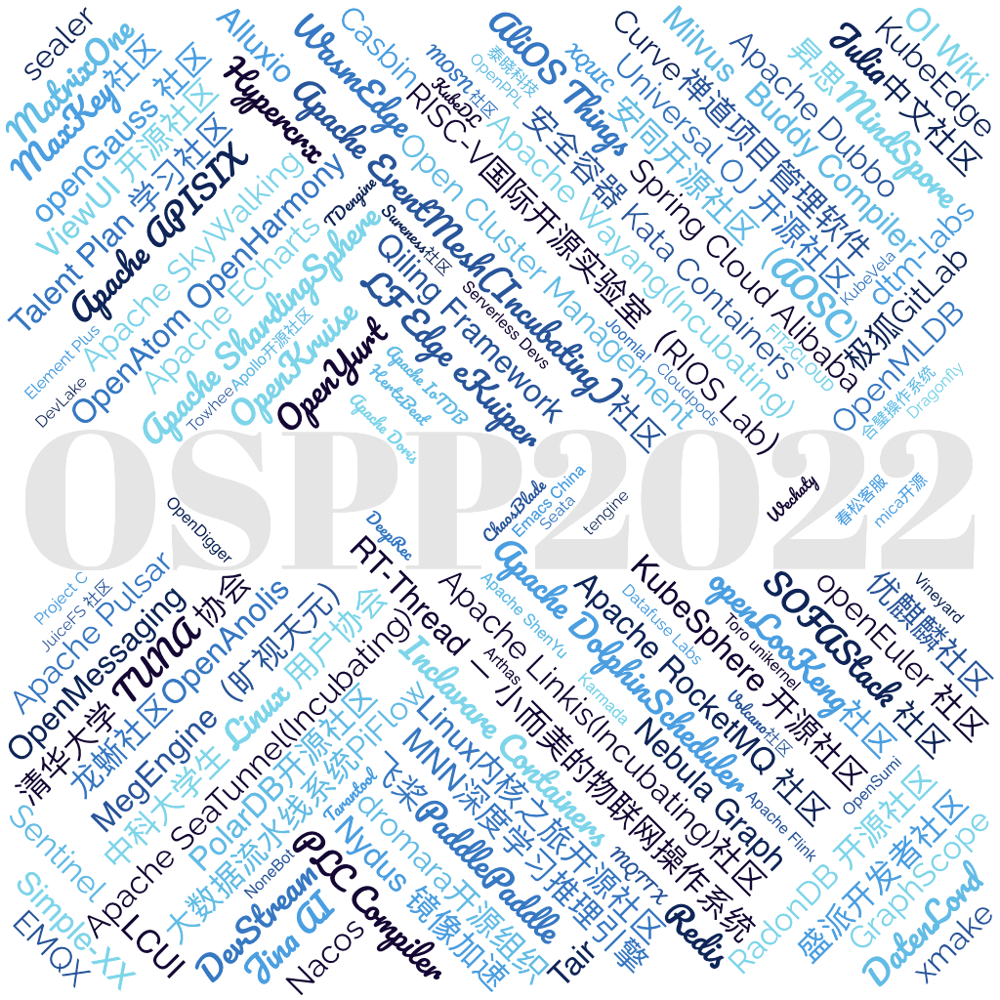
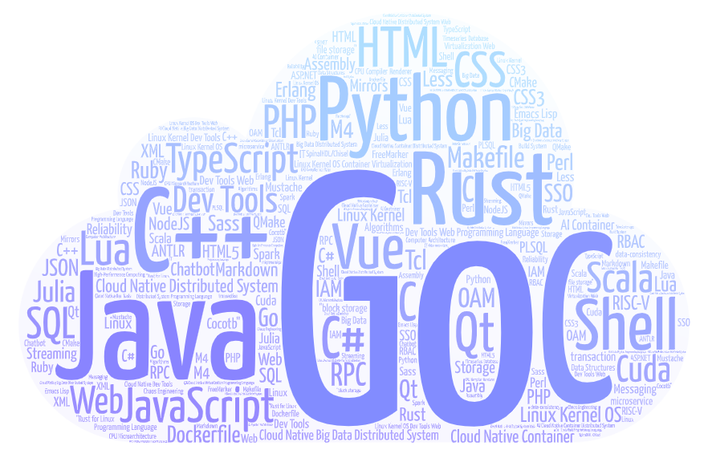

## OSPP 2022 统计

在2022年共有124个社区参与到OSPP中，有400+的项目供学生申请。因为活动机制允许社区赞助项目，所以有部分社区的项目格外多，比如kubeEdge。

## 注意⚠️

**下面内容是基于官网数据做的一些分析，可能存在一定的误差，请以官网为准。**

## OSPP 2022 社区技术栈 关键词 top 10

贡献则会一般选择社区时会基于自己的技术栈进行选择，而官网的搜索还有待改进没，按个人技术栈搜社区时搜索结果并不够准确。

我统计了所有社区介绍页面提到的技术栈，按照关键词进行排序，得到了下面的表格。

|   技术栈   | 提及次数 |
| :--------: | :------: |
|     Go     |    40    |
|    Java    |    40    |
|   Python   |    36    |
|    C++     |    32    |
| JavaScript |    24    |
|     C      |    20    |
|    Rust    |    15    |
| TypeScript |    11    |
|   Shell    |    11    |
|    HTML    |    6     |
|    Vue     |    6     |
|    CSS     |    6     |

## 所有社区统计

本次总计大约有98个技术栈关键词。数据文件可以自行在 [腾讯文档](https://docs.qq.com/sheet/DWU53YnN3ZlBrdnhQ) 处下载。也可以直接在本页面上查找。

| 社区                               | 官网链接                                                     | 技术栈                                                       |
| ---------------------------------- | ------------------------------------------------------------ | ------------------------------------------------------------ |
| openEuler 社区                     | https://openeuler.org/  |      Linux Kernel OS Container Virtualization                                                        |
| Apache APISIX                      | https://apisix.apache.org/                                   | Lua,JavaScript,Go,HTML,CSS,Python,Shell,Perl                 |
| MegEngine（旷视天元）              | https://www.megengine.org.cn/                                | C++,Python,Cuda                                              |
| Apache Pulsar                      | https://pulsar.apache.org                                    | Cloud Native Big Data Distributed System,Streaming,Storage   |
| openLooKeng社区                    | https://openlookeng.io/                                      | Big Data,Java                                                |
| 泰晓科技                           | http://tinylab.org                                           | C,Makefile,Shell,C++,Rust                                    |
| Apache SkyWalking                  | https://skywalking.apache.org                                | Java,Go,Python,JavaScript,C++,Lua,Vue,TypeScript,ASP.NET     |
| 清华大学 TUNA 协会                 | https://tuna.moe                                             | Linux Kernel Dev Tools,服务器运维，网络编程，系统工具        |
| Apache RocketMQ 社区               | https://rocketmq.apache.org/                                 | Cloud Native Big Data Distributed System,Messaging           |
| Apache Dubbo                       | https://dubbo.apache.org/                                    | Cloud Native Distributed System,RPC,Java                     |
| AliOS Things                       | https://www.aliyun.com/product/aliosthings                   | C,C++,Python                                                 |
| openGauss 社区                     | https://opengauss.org/zh/                                    | C,C++,Java,Python                                            |
| 大数据流水线系统PiFlow             | http://piflow.mulanos.cn/                                    | Scala,Java,JavaScript,Vue                                    |
| Apache Doris                       | https://doris.apache.org                                     | C++,Java                                                     |
| RT-Thread — 小而美的物联网操作系统 | https://www.rt-thread.org/                                   | C,C++,Rust,JavaScript                                        |
| KubeEdge                           | kubeedge.io                                                  | Cloud Native Container,Go,Python                             |
| Apache EventMesh(Incubating)社区   | https://eventmesh.apache.org                                 | Java,Go                                                      |
| Linux内核之旅开源社区              | http://kerneltravel.net/                                     | C,Go,Python                                                  |
| Casbin                             | https://casbin.org/                                          | Cloud Native Distributed System Web,Go,JavaScript            |
| Apache IoTDB                       | http://iotdb.apache.org/                                     | Java,Python,C++,Timeseries，Database                         |
| Simple-XX                          | https://github.com/Simple-XX                                 | Linux Kernel OS,CPU，Compiler，Renderer                      |
| Apache SeaTunnel(Incubating)       | https://seatunnel.apache.org                                 | Java                                                         |
| SOFAStack 社区                     | https://www.sofastack.tech/                                  | Java,Go                                                      |
| OpenSumi                           | https://opensumi.com/zh                                      | TypeScript,JavaScript,NodeJS                                 |
| OpenMLDB                           | https://openmldb.ai/                                         | C++,Java,Python,SQL,Spark                                    |
| Jina AI                            | https://jina.ai/                                             | Python                                                       |
| PolarDB开源社区                    | https://www.polardbx.com/                                    | C++,Java,C,Go                                                |
| GraphScope                         | https://github.com/alibaba/graphscope                        | C++,Python,Rust,Java                                         |
| OpenYurt                           | https://openyurt.io/                                         | Go,JavaScript,Shell                                          |
| Nebula Graph                       | https://nebula-graph.com.cn/                                 | C++,Go,Python,Java                                           |
| 安全容器 Kata Containers           | https://katacontainers.io/                                   | Go,Rust,Shell                                                |
| WasmEdge                           | https://wasmedge.org/                                        | C++,Rust,JavaScript                                          |
| 春松客服                           | https://www.cskefu.com/                                      | Java,JavaScript,HTML,CSS                                     |
| Sentinel                           | https://sentinelguard.io                                     | Cloud Native Distributed System,Reliability                  |
| Apache ShardingSphere              | https://shardingsphere.apache.org/                           | Java                                                         |
| KubeSphere 开源社区                | https://kubesphere.com.cn/                                   | Go,Dockerfile,Java,JavaScript,Shell                          |
| tengine                            | http://tengine.taobao.org/                                   | C                                                            |
| 禅道项目管理软件                   | https://www.zentao.net                                       | Dev Tools,PHP                                                |
| MNN深度学习推理引擎                | https://github.com/alibaba/MNN                               | C++,Python,Assembly                                          |
| dtm-labs                           | https://github.com/dtm-labs                                  | Go,C#                                                        |
| 安同开源社区（AOSC）               | https://aosc.io/                                             | Linux Kernel,Rust,C,C++,Python,Shell,M4,CMake,Makefile,QMake |
| ViewUI 开源社区                    | https://www.iviewui.com/                                     | JavaScript,HTML,CSS                                          |
| Apache Linkis(Incubating)社区      | https://linkis.apache.org                                    | Java,Scala,Vue                                               |
| Julia中文社区                      | https://discourse.juliacn.com/                               | Julia                                                        |
| Qiling Framework                   | https://github.com/qilingframework/qiling                    | Python                                                       |
| Universal OJ 开源社区              | https://github.com/UniversalOJ                               | PHP,C++,Python,C                                             |
| Apache DolphinScheduler            | https://dolphinscheduler.apache.org/zh-cn/index.html         | Java,Python,Vue                                              |
| Apache ShenYu                      | https://shenyu.apache.org/                                   | Java,JavaScript                                              |
| RadonDB 开源社区                   | https://radondb.com                                          | Go                                                           |
| KubeDL                             | https://kubedl.io/                                           | AI Cloud Native Container Distributed System                 |
| Vineyard                           | https://v6d.io                                               | C++,Python,Rust,Go                                           |
| xmake                              | https://xmake.io                                             | Programming Language,Build System，编译工具，跨平台开发，包管理 |
| DeepRec                            | https://github.com/alibaba/DeepRec                           | C++,Python                                                   |
| Nydus 镜像加速                     | https://nydus.dev/                                           | Rust,Go                                                      |
| Open Cluster Management            | https://open-cluster-management.io/                          | Go                                                           |
| OpenKruise                         | https://openkruise.io/                                       | Go                                                           |
| Serverless Devs                    | https://www.serverless-devs.com                              | JavaScript,TypeScript,Java,HTML,CSS,Go                       |
| Curve                              | https://www.opencurve.io/                                    | Cloud Native Distributed System,block storage file storage   |
| LF Edge eKuiper                    | https://www.lfedge.org/projects/ekuiper/                     | Go,Python                                                    |
| Joomla!                            | https://www.joomla.org/                                      | Dev Tools Web Programming Language                           |
| Project C                          | https://gitlab.com/alfredchen/projectc                       | Linux Kernel OS                                              |
| DatenLord                          | https://datenlord.github.io                                  | Rust,Scala,Python,Shell,Tcl,Dockerfile,Rust for Linux SpinalHDL/Chisel Cocotb |
| OI Wiki                            | https://about.oi-wiki.org/                                   | Dev Tools Web Programming Language,Markdown,JavaScript,CSS,Algorithms,Data Structures |
| Spring Cloud Alibaba               | https://github.com/alibaba/spring-cloud-alibaba              | Java                                                         |
| Redis                              | https://github.com/redis/redis                               | C                                                            |
| 优麒麟社区                         | https://www.ubuntukylin.com/index-cn.html                    | Qt,C++,Shell                                                 |
| Seata                              | https://seata.io/zh-cn/                                      | Distributed System Programming Language,transaction,data-consistency,microservice |
| Tarantool                          | https://www.tarantool.io/en/                                 | C,C++,Lua,Python,SQL                                         |
| Milvus                             | https://www.milvus.io/                                       | Go,Java,C++,Python                                           |
| Apache Wayang(Incubating)          | https://wayang.apache.org/                                   | Java,Python,Scala                                            |
| Wechaty                            | https://wechaty.js.org/                                      | Python,Go,JavaScript,Java                                    |
| OpenDigger                         | http://www.x-lab.info/open-digger/#/                         | JavaScript,TypeScript                                        |
| JuiceFS 社区                       | https://juicefs.com/                                         | Go,C++,Python,Java                                           |
| 飞桨PaddlePaddle                   | https://www.paddlepaddle.org.cn/                             | Python,C++                                                   |
| Emacs China                        | https://emacs-china.org/                                     | Dev Tools,Emacs Lisp,Python,JavaScript                       |
| 合璧操作系统                       | https://hybridos.fmsoft.cn/                                  | C,C++                                                        |
| 昇思MindSpore                      | https://www.mindspore.cn                                     | AI Container                                                 |
| Toro unikernel                     | http://www.torokernel.io                                     | OS Cloud Native Virtualization Programming Language          |
| 极狐GitLab                         | https://jihulab.com/gitlab-cn/gitlab                         | Ruby,Go                                                      |
| Volcano社区                        | https://volcano.sh/zh/                                       | Go                                                           |
| 龙蜥社区OpenAnolis                 | https://openanolis.cn                                        | C,Java,Python,C++,Go,Rust                                    |
| mica开源                           | https://gitee.com/596392912                                  | Java                                                         |
| HertzBeat                          | https://hertzbeat.com                                        | Java,TypeScript,HTML,Sass                                    |
| FIT2CLOUD                          | https://www.fit2cloud.com                                    | Java,Python,JavaScript,Go,FreeMarker,HTML                    |
| Nacos                              | nacos.io                                                     | Java                                                         |
| Sureness社区                       | https://su.usthe.com/                                        | Web,Java                                                     |
| NoneBot                            | https://nonebot.dev                                          | Dev Tools Web,Chatbot                                        |
| KubeVela                           | kubevela.io                                                  | Cloud Native Container Distributed System,OAM                |
| MaxKey社区                         | https://maxkeytop.gitee.io/                                  | Java,JavaScript,JSON,Markdown,SQL,TypeScript,XML,CSS,HTML,Less,PLSQL,Shell,IAM，SSO，RBAC |
| Apollo开源社区                     | https://www.apolloconfig.com/                                | Cloud Native Distributed System                              |
| Dragonfly                          | https://d7y.io/                                              | Cloud Native Container                                       |
| Hypercrx                           | https://crx.hypertrons.io/                                   | TypeScript,JavaScript,CSS                                    |
| Tair                               | https://github.com/alibaba/TairHash                          | C,C++                                                        |
| Towhee                             | https://towhee.io/                                           | Python                                                       |
| MOSN 社区                          | https://mosn.io/                                             | Go,Java                                                      |
| 盛派开发者社区                     | https://weixin.senparc.com/                                  | C#,C#,CSS3,HTML5,SQL,Python                                  |
| OpenPPL                            | https://openppl.ai/                                          | Cuda,C++,Python                                              |
| Inclavare Containers               | https://inclavare-containers.io                              | Go,Rust,C                                                    |
| Arthas                             | https://arthas.aliyun.com/                                   | Dev Tools                                                    |
| sealer                             | https://github.com/alibaba/sealer                            | Go,Rust                                                      |
| MQTT X                             | https://mqttx.app/zh                                         | TypeScript,Vue                                               |
| OpenAtom OpenHarmony               | https://www.openharmony.cn/mainPlay                          | C,C++,JavaScript                                             |
| Datafuse Labs                      | https://github.com/datafuselabs                              | Rust,Go,Java,Python,JavaScript,TypeScript                    |
| MatrixOne                          | https://github.com/matrixorigin/matrixone                    | Go,Java,Python,Assembly                                      |
| Karmada                            | https://karmada.io/                                          | Go                                                           |
| RISC-V国际开源实验室（RIOS Lab）   | https://rioslab.org                                          | Linux Kernel OS Dev Tools Web,RISC-V,Computer Architecture,CPU Microarchitecture,High-Performance Computing |
| TDengine                           | https://www.taosdata.com/                                    | Big Data Distributed System,IT运维，物联网，工业互联网，车联网 |
| Apache Flink                       | https://flink.apache.org/                                    | Java,Scala                                                   |
| Cloudpods                          | https://www.cloudpods.org                                    | Go,Vue                                                       |
| XQUIC                              | https://github.com/alibaba/xquic                             | C                                                            |
| Buddy Compiler                     | https://buddy-compiler.github.io/                            | C++                                                          |
| Apache ECharts                     | http://echarts.apache.org                                    | Virtualization Web                                           |
| PLC Compiler                       | https://gitee.com/iec61131-plccompiler                       | C++,C,Java,ANTLR                                             |
| OpenMessaging                      | http://openmessaging.cloud/                                  | AI Cloud Native Big Data Distributed System                  |
| EMQX                               | https://www.emqx.io/zh                                       | Erlang,Shell,C                                               |
| DevStream                          | https://www.devstream.io                                     | Go                                                           |
| Alluxio                            | www.alluxio.io                                               | Java,TypeScript,Go,Shell,C++,Mustache                        |
| dromara开源组织                    | https://dromara.org/                                         | Java,JavaScript,Go                                           |
| 中科大学生 Linux 用户协会          | https://lug.ustc.edu.cn/                                     | Go,Rust,Python,Mirrors,Linux                                 |
| LCUI                               | lcui.lc-soft.io                                              | C,C++,JavaScript,TypeScript                                  |
| DevLake                            | https://github.com/merico-dev/lake                           | Go                                                           |
| ChaosBlade                         | https://chaosblade.io/                                       | Cloud Native Dev Tools,Chaos Engineering                     |
| Talent Plan 学习社区               | https://tidb.io/talent-plan                                  | Go,Rust                                                      |
| Element Plus                       | https://element-plus.org/                                    | Web                                                          |
